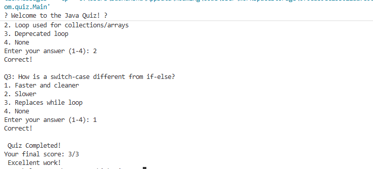

🧠 Online Quiz App (Java Console Project)
📌 Project Overview

This is a simple console-based Java quiz application built as part of a Java Developer Internship task.
The app tests basic Java knowledge by asking multiple-choice questions, accepts user answers, and calculates the final score.
It demonstrates the use of loops, conditionals, collections, user input handling, and basic OOP concepts in Java.

✨ Features

✅ Multiple-choice questions with 4 options each
✅ Accepts user input for answers
✅ Calculates and displays the final score
✅ Shows correct/incorrect feedback after each question
✅ Uses List and loops for question handling
✅ Final result summary with feedback messages
✅ Optional: Shuffle questions for randomness

🛠️ Tech Stack

☕ Java 21+

💻 Console / Terminal

🧰 VS Code / IntelliJ / STS (any Java IDE)

📁 Project Structure
QuizApp/
├── src/
│   └── com/quiz/
│       ├── Question.java      # Model class for question structure
│       ├── Quiz.java          # Handles question logic, scoring, feedback
│       └── Main.java          # Entry point to run the quiz
└── README.md

🚀 How to Run

Clone this repository:

git clone https://github.com/your-username/quiz-app-java.git

Navigate to the project directory:

cd quiz-app-java

Compile the Java files:

javac com/quiz/*.java

Run the application:

java com.quiz.Main

## 📸 Screenshot

Here’s how the quiz output looks when you run it:

🧪 Example Run
🎓 Welcome to the Java Quiz! 🎓

Q1: What are Java loops?
A. Conditional statements
B. Repetitive execution blocks
C. Data structures
D. None of the above
Enter your answer (1-4): 2
✅ Correct!

Q2: What is an enhanced for-loop?
A. A loop for integers
B. Loop used for collections/arrays
C. Deprecated loop
D. None
Enter your answer (1-4): 2
✅ Correct!

🎯 Quiz Completed!
Your final score: 2/2
🏆 Excellent work!

📊 Concepts Used

Control Flow: for loop, if-else

Collections: List, ArrayList

OOP: Classes, objects, encapsulation

Logic: Scoring system, result evaluation

I/O: User input with Scanner